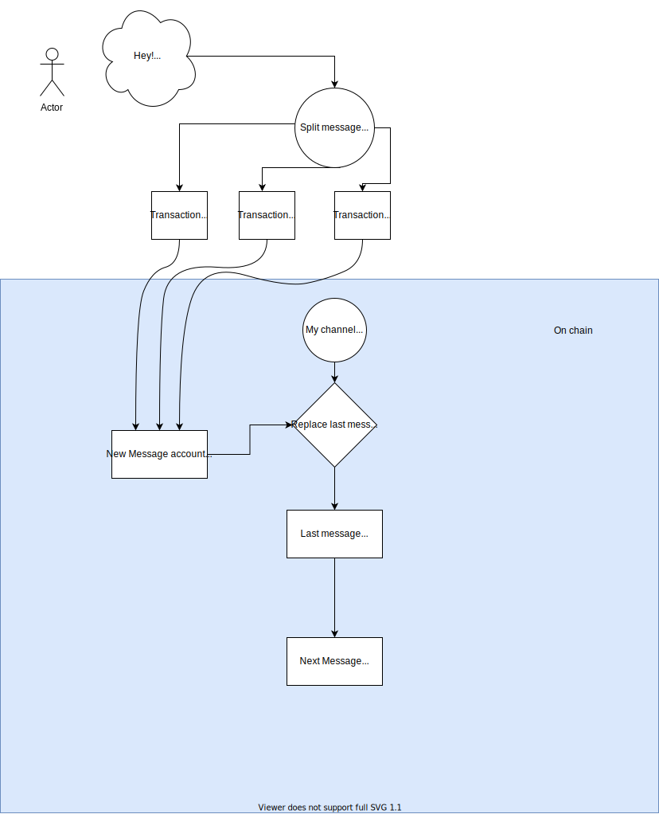

# Solvei - Social media app on Solana

Learning solana by programming a fun app

## MVP idea

- Create channels (A) ✅
- Send messages to channel (B) ✅
- Frontend - RPC (Web3 client) send and read messages React(?) (C)
- Encryption with symmetric keys(D)

# How? 

